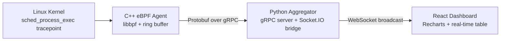

# Kernel-Stream
### Real-time Linux process observability from kernel space to browser UI


## Overview
Kernel-Stream is a full-stack, real-time Linux observability pipeline engineered to trace process execution end-to-end. It hooks `sched_process_exec` inside the Linux kernel using eBPF, captures and structures events in a C++ agent, serializes telemetry with Protobuf, streams it through gRPC to a Python aggregation layer, and fan-outs live updates to a React dashboard over WebSockets. The result is a low-latency telemetry path from kernel events to operator-facing visualization.

## Architecture Diagram


## Tech Stack
- **Kernel / Agent**
  - Linux eBPF (`tp/sched/sched_process_exec`)
  - libbpf + BPF ring buffer
  - C++ userspace loader/client
  - Protobuf + gRPC C++ stubs

- **Backend**
  - Python 3
  - gRPC Python server
  - Flask + Flask-SocketIO
  - Flask-CORS

- **Frontend**
  - React (Vite)
  - `socket.io-client`
  - Recharts
  - Lucide React icons

## Prerequisites
- Ubuntu / WSL2 (Linux kernel with eBPF/BTF support)
- `clang`
- `libbpf-dev`
- Python 3 (`venv` enabled)
- Node.js + npm

## Quick Start
### 1) Build backend + agent artifacts
```bash
cd ~/Kernel-Stream
bash build_and_run.sh
```

### 2) Install frontend dependencies
```bash
cd ~/Kernel-Stream/web
npm install
```

### 3) Start the services (three terminals)
**Terminal A: Python Aggregator (gRPC + WebSocket bridge)**
```bash
cd ~/Kernel-Stream
source venv/bin/activate
python3 server/aggregator.py
```

**Terminal B: React Dashboard**
```bash
cd ~/Kernel-Stream/web
npm run dev
```

**Terminal C: eBPF Agent**
```bash
cd ~/Kernel-Stream
sudo ./monitor
```

After startup, open the Vite URL shown in Terminal B (typically `http://localhost:5173`) to view live process execution telemetry.

## Future Scope
- Persist event streams into SQLite for replay, audit, and offline analytics
- Add network packet/event instrumentation for process-to-network correlation
- Extend telemetry schema with CPU, RSS memory, and per-process lifecycle metrics
- Introduce alerting rules (threshold-based and anomaly-driven) on top of the event bus

